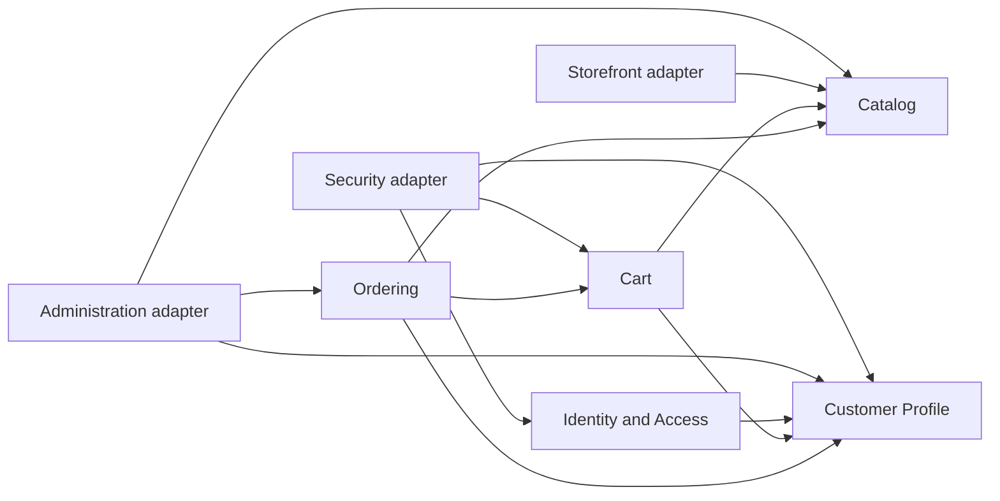

# Context Map

Shop Happens is a modular monolith with five bounded contexts. `Administration`, `Security`, and
`Storefront` are protected inbound delivery slices, not additional bounded contexts. Contexts and
delivery adapters collaborate through provider-owned contracts in `application.port.in`; they do
not import another context's domain, application services, output ports, or persistence model.

## Contexts

- [Identity and Access](./contexts/account/CONTEXT.md): registers Accounts and establishes who may
  access the application
- [Customer Profile](./contexts/customer/CONTEXT.md): represents Customers and their saved Addresses
- [Catalog](./contexts/catalog/CONTEXT.md): describes Product families, sellable Product Variants,
  Categories, prices, and shop-wide stock
- [Cart](./contexts/cart/CONTEXT.md): maintains Product Variant selections for a Customer or an
  anonymous browser session
- [Ordering](./contexts/ordering/CONTEXT.md): reviews a Cart and records the resulting purchase as an
  Order

## Published-contract dependencies

An arrow `A -> B` (rendered `A → B` in prose) means “consumer A depends on provider B's published
contract.” The diagram shows
all direct cross-context and inbound-delivery edges enforced by `ArchitectureRulesTest`; shared
presentation and shared-kernel edges are described separately below.

- **Identity and Access → Customer Profile**: customer Account registration creates the
  corresponding Customer through Customer Profile's published input contract. Identity and Access
  retains no Customer aggregate or profile persistence type.
- **Identity and Access account deletion**: Account coordinates current Customer Profile and
  Customer Cart cleanup through consumer-owned output ports and provider-owned published input
  contracts. Customer and Cart own their state; shared-kernel identifiers are logical references,
  not cross-context database foreign keys. Historical Orders remain retained.
- **Cart → Customer Profile**: Cart's web adapter resolves an authenticated Customer through the
  published current-customer contract; an anonymous request falls back to a Guest Cart.
- **Cart → Catalog**: Cart stores Product Variant identifiers and quantities. Its web adapter asks
  Catalog for current display facts; Cart does not promise price, availability, or stock.
- **Ordering → Customer Profile**: checkout resolves Customer-owned shipping and billing Addresses
  and stores immutable Order Address snapshots.
- **Ordering → Cart**: checkout loads the Customer Cart and clears it only in the successful order
  transaction.
- **Ordering → Catalog**: checkout's anti-corruption adapters translate Ordering requests and
  failures at the boundary while Catalog authoritatively purchases each selected Product Variant.
- **Security → Identity and Access, Customer Profile, Cart**: Security composes authenticated
  Account and Customer identity and triggers retry-safe Guest Cart merge through published
  contracts. It does not own any of those business models.
- **Administration → Catalog, Customer Profile, Ordering**: the protected administration delivery
  adapter exposes Catalog mutations and read-only Customer and Order views through the owning
  contexts' published contracts. See [ADR-0005](./docs/adr/0005-administration-as-catalog-delivery-channel.md).
- **Storefront → Catalog**: the public delivery adapter obtains Product and Category views through
  Catalog's browsing contracts.

The graph is acyclic. [ADR-0002](./docs/adr/0002-cross-context-contract-ownership.md) records why
providers own published contracts and consumers translate them instead of sharing domain or
persistence types.

## Shared support

The deliberately small `sharedkernel` contains stable `AccountId`, `CustomerId`, `ProductId`, and
`ProductVariantId` meanings plus `Money`/`Currency` semantics. These values express common
identity and money, not ownership arrows. Aggregates, commands, exceptions, repositories, framework
types, and context-local identifiers remain outside it. See
[ADR-0004](./docs/adr/0004-shared-kernel-identifiers-and-money.md) and
[ADR-0010](./docs/adr/0010-product-variants-and-sellable-identity.md).

Shared public-page presentation support lives in `shared.web` and is owned by no bounded context.
It contains presentation concepts such as canonical URLs and SEO metadata, never business behavior.

## External event delivery

Ordering appends `ordering.order-placed.v1` to its PostgreSQL outbox in the checkout transaction.
The optional publisher sends committed rows to Kafka later; Kafka is not part of checkout's success
boundary. The order-confirmation consumer uses the event to send an asynchronous customer email
through the shared mail adapter; email delivery is not part of checkout's success boundary.
Delivery behavior and operator recovery are documented in the
[outbox runbook](./docs/operations/outbox.md).

## Current and planned boundaries

The implemented checkout is an account-required, EUR merchandise purchase: it reviews current
Product Variant facts, records immutable product/variant, price, quantity, and address snapshots,
and deducts shop-wide stock. It is not a full commercial Quote and does not calculate shipping or
tax or process payment.

Payments, tax and shipping calculation, reservations, fulfillment, returns/refunds, and asynchronous
consumers remain planned capabilities. The future operating assumptions and proposed lifecycle
boundaries are recorded in [ADR-0007](./docs/adr/0007-commerce-operating-model-baseline.md),
[ADR-0008](./docs/adr/0008-payment-and-reservation-boundaries.md), and
[ADR-0009](./docs/adr/0009-cross-context-commerce-integrity.md); they do not describe implemented
workflows.
