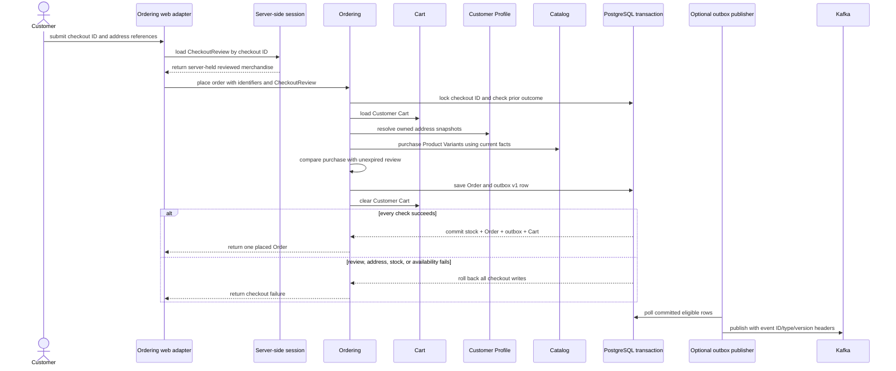

# Spring Boot Ecommerce Example

This is a senior software engineer's Java learning project: a deliberately bounded ecommerce
application used to practise Spring Boot, domain modeling, persistence, security, testing, and
delivery trade-offs. It demonstrates a simulated merchandise purchase workflow, not a
production-ready retail platform.

## Technology

- Java 21 and Spring Boot 4
- Spring MVC, Thymeleaf, and Spring Security
- Spring Data JPA, PostgreSQL, Flyway, and Redis
- Tailwind CSS and daisyUI
- React 19, React Admin, and Vite for Catalog administration
- Maven, Docker Compose, and Testcontainers

## Current Architecture

The application is a modular monolith with separate `account`, `customer`,
`catalog`, `cart`, and `ordering` bounded contexts. Contexts collaborate through
provider-owned application-port contracts rather than importing another context's domain or
persistence internals. Administration, Security, and Storefront are protected inbound delivery
adapters rather than additional bounded contexts. The complete consumer-to-provider graph is in the
[context map](CONTEXT_MAP.md) and is enforced against compiled dependencies by
`ArchitectureRulesTest`.

Checkout is intentionally a synchronous PostgreSQL consistency boundary. Order
creation, stock deduction, cart clearing, and creation of the corresponding
integration-outbox row commit or roll back together. Kafka is not required for a
checkout to succeed. The checkout review contains current merchandise facts for selected Product
Variants; the authoritative purchase is compared with that review before the Order is accepted.
Shipping and tax calculation and payment processing are not implemented.



Successful checkouts produce the immutable, versioned
`ordering.order-placed.v1` event. It contains both product-family and sellable
variant identity plus immutable purchase snapshots, not JPA entities or mutable
cart objects. Kafka publication is asynchronous and enabled by default. Set
`ORDERING_EVENTS_KAFKA_ENABLED=false` to persist the event in PostgreSQL without
publishing it.

The Kafka publisher currently provides bounded polling, broker-acknowledged
publication, event metadata headers, bounded retries, and quarantine after five
failed attempts. Delivery is at least once: consumers must use the event ID for
idempotency. The order-confirmation consumer uses the same event ID to send an
asynchronous customer email through Spring Mail. Local Compose routes it to
Mailpit at `http://localhost:8025`; email delivery does not change checkout
success. See the [outbox operations runbook](docs/operations/outbox.md) for
inspection, targeted replay, and the current single-publisher limitation.

### Architectural decisions

- [ADR-0002](docs/adr/0002-cross-context-contract-ownership.md) keeps contracts with their defining
  contexts. This rejects shared domain/JPA models; the cost is explicit adapter mapping and contract
  evolution.
- [ADR-0004](docs/adr/0004-shared-kernel-identifiers-and-money.md) shares only stable identifiers and
  money semantics. This rejects both duplicated meanings and a broad common model; the cost is
  coordinated change when a genuinely shared value evolves.
- [ADR-0005](docs/adr/0005-administration-as-catalog-delivery-channel.md) treats Administration as a
  delivery channel. A sixth context and direct database writes were rejected; each resource instead
  needs an owner-provided contract and an explicit protected route.
- [ADR-0006](docs/adr/0006-checkout-transaction-boundary.md) keeps checkout atomic in PostgreSQL and
  Kafka post-commit. A later service split would pay the cost of replacing that local transaction
  with reservation and process-manager/saga coordination.
- [ADR-0010](docs/adr/0010-product-variants-and-sellable-identity.md) separates Product-family identity
  from stable Product Variant identity rather than using mutable SKU as a foreign key. That choice
  carries compatibility and migration costs.

## Running Locally

### Prerequisites

- Java 21
- Node 22
- Docker and Docker Compose

Use `./mvnw` for backend work, so you do not need a globally installed Maven.
Frontend dependencies and assets are managed separately with npm; the Docker
build composes the frontend and backend stages into the deployment image.

The common local commands are also available through `make`. Run `make help` to
see the targets. `make seed-demo` is destructive and replaces the local Compose
database with the themed sample catalog. When running Spring Boot on the host,
the application must already be running when you execute `make seed-demo`, so
Flyway has created the schema first. The `make up` target starts infrastructure
services only; it does not start the application container.

The simplest local setup on Windows, WSL, macOS, or Linux is:

1. Install Java 21 and Node 22.
2. Start PostgreSQL and Redis with Docker Compose.
3. Run the app with Maven from the host.

To run PostgreSQL, Redis, and the Java application in containers:

```bash
docker compose up --build
```

Open <http://localhost:8080> after the application starts. Stop the stack with
`docker compose down`.

Compose mounts PostgreSQL at `/var/lib/postgresql/data` through the named `postgres_data` volume;
ordinary container recreation therefore retains the local database until that volume is explicitly
removed. The `prod` profile honors forwarded HTTPS headers and configures the session cookie as
`Secure`, `HttpOnly`, and `SameSite=Strict`; `ProductionSessionCookieIT` covers login, authenticated
reuse, and logout expiry for that profile.

The application uses PostgreSQL, Redis, and Kafka. When running the application directly
on the host, start those services first with Docker Compose:

```bash
docker compose up -d postgres redis kafka
npm ci
npm run build:frontend
./mvnw spring-boot:run
```

Host-run Kafka clients use `localhost:29092`. Services on the Compose network use
`kafka:9092`. Kafka returns advertised listener addresses after the initial bootstrap
connection, so each runtime must use the listener intended for its network.

Open <http://localhost:8080> after the application starts.

To run the containerized application with verbose development diagnostics:

```bash
SPRING_PROFILES_ACTIVE=dev docker compose up --build
```

By default the application logs quietly and hides SQL bindings. To opt into
verbose local diagnostics (Spring Security trace and Hibernate SQL/binding
logging), activate the `dev` profile:

```bash
SPRING_PROFILES_ACTIVE=dev ./mvnw spring-boot:run
```

The `dev` profile runs schema migrations only. Demo data is deliberately not a
Flyway migration because it truncates application tables. To import it, use only
a disposable local Compose database. Start the application once so Flyway creates
the schema, stop it with Ctrl+C, import with error-on-first-failure enabled, and
then restart the application:

```bash
docker compose up -d postgres redis
./mvnw spring-boot:run
# After migrations finish, stop the application with Ctrl+C.
docker compose exec -T postgres psql -U demo -d demo -v ON_ERROR_STOP=1 -f /seed/demo-data.sql
./mvnw spring-boot:run
```

The import command is the same on Windows, WSL, macOS, and Linux. It fails if
the schema has not been migrated and replaces the demo tables, so it is intended
only for a disposable local database. The command above uses the default Compose
credentials; if `POSTGRES_USER` or `POSTGRES_DB` is customized, use those values
in the `psql` command.

Run the backend test suite with:

```bash
./mvnw test
```

`./mvnw verify` runs the backend lifecycle, including formatting, Checkstyle,
PMD, unit tests, architecture tests, and integration tests. The integration
tests start disposable PostgreSQL and Redis
containers; Docker must be available for those tests. It also generates the JaCoCo coverage report at
`target/site/jacoco/index.html`.

The repeatable frontend and backend verification commands are:

```bash
npm ci
npm run test:admin
npm run build:admin
./mvnw verify
```

Maven does not build the React administration application. Run the npm build before host packaging,
or use the Dockerfile, whose frontend stage builds the CSS and React bundle and whose backend stage
copies those generated assets before packaging the application.

Format Java sources with:

```bash
./mvnw spotless:apply
```

## Demo Data

The database schema is managed by Flyway migrations in `db/migration` and
checked against the JPA entities at startup via `ddl-auto: validate`:

- `V1__create_account_schema.sql` — accounts
- `V2__create_catalog_schema.sql` — categories, product families, and sellable variants
- `V3__create_cart_schema.sql` — customer carts
- `V4__create_ordering_schema.sql` — orders, checkout idempotency, and order query indexes
- `V5__create_integration_outbox.sql` — transactional integration events
- `V6__create_catalog_attribute_schema.sql` — attribute definitions, values, and assignments

The optional seed is maintained in `scripts/demo-data.sql`, outside Flyway's
migration locations. Use the Compose import command above instead of copying it
into a database manually.

Do not edit an applied migration in a shared environment. Add a new numbered
migration instead.

## Kafka Publishing

Kafka publishing is enabled by default, and the default Compose stack provides a
single-node Kafka broker. When running the app directly on the host, use the
broker's external listener at `localhost:29092`; the Compose application uses the
internal `kafka:9092` listener. To disable publishing and persist events only:

```bash
ORDERING_EVENTS_KAFKA_ENABLED=false \
./mvnw generate-resources spring-boot:run
```

The publisher reads unpublished rows from `integration_outbox`, uses each
stored event type as its Kafka topic, uses the order ID as the Kafka key, and
marks a row published only after the broker acknowledges the send. New
checkouts store `ordering.order-placed.v1`; the stored event type remains the
Kafka topic for replay compatibility. The event
type, version, and event ID are included as Kafka headers. Producer idempotence
is enabled by default when Kafka is enabled. The default Compose stack includes
a single-node Kafka broker.

### Customer order confirmation email

The order-confirmation consumer and email notifications are enabled by default.
Compose sends through the existing Spring Mail configuration and routes local
mail to Mailpit. Set `NOTIFICATIONS_EMAIL_ENABLED=false` to disable email
notifications. Configure `NOTIFICATIONS_EMAIL_FROM` for the sender address. The
event contains the placement-time customer recipient snapshot, so the email does
not depend on later Customer Profile changes. Delivery state is stored in
`order_confirmation_delivery`; transient failures retry and repeated failures
are quarantined after five attempts.

### Outbox inspection and recovery

An event-delivery failure does not roll back the already committed order.
Non-quarantined rows retry with backoff; after five failed attempts a row is
quarantined and restoring broker connectivity does not release it. Use the
[outbox operations runbook](docs/operations/outbox.md) to inspect due and
quarantined work and to replay one quarantined event after resolving its cause.
The runbook also covers at-least-once delivery, consumer deduplication, and why
only one publisher instance is currently supported.

## Frontend CSS

To rebuild Tailwind CSS directly:

```bash
npm run build:css
```

During UI development, watch for CSS changes with:

```bash
npm run dev:css
```

## Administration frontend

The protected `/admin` application mounts a Dashboard at its root, Product-family management with
nested Product Variant creation/edit/delete, flat Category management, read-only Order and Customer
list/detail resources, and a Storefront route. The backend forwards only these finite SPA shapes:

- `/admin`
- `/admin/products`, `/admin/products/create`, and `/admin/products/{id}`
- `/admin/categories`, `/admin/categories/create`, and `/admin/categories/{id}`
- `/admin/orders` and `/admin/orders/{orderNumber}/show`
- `/admin/customers` and `/admin/customers/{id}/show`
- `/admin/storefront`

All four list transports use fixed server ordering and ignore React-admin sort state, so their
column sorting controls are disabled rather than sorting only the visible page.

The typed Catalog data provider is the sole resource transport adapter. It
delegates to the shared API client, which owns same-origin credentials and the
server-provided CSRF header name and token. Mutations propagate the current revision in the request
body or a quoted `If-Match` header according to the endpoint contract; stale revisions and
category-in-use conflicts are surfaced without automatic retries.

Manage frontend dependencies and the production bundle separately from Maven:

```bash
npm ci
npm run test:admin
npm run build:admin
```

The generated bundle is written to `src/main/resources/static/admin/` and is
ignored by Git.

For frontend development with automatic rebuilds, run Spring Boot with the
Maven plugin's `addResources` configuration and start the admin bundle watcher
in separate terminals:

```bash
./mvnw spring-boot:run
npm run -w admin-web build:watch
```

The application serves resources directly from `src/main/resources`, so Java
does not need to be restarted after frontend changes. Run `npm run dev:css` in
an additional terminal when changing Tailwind input styles. This watch mode
reloads rebuilt assets on refresh; Vite's HMR development server is not used.

## Evidence boundary

The September 2026 convergence work recorded focused backend architecture, security, Catalog,
checkout, concurrency, persistence, and administration gates. Its latest React-admin gate recorded
13 test files with 67 passing tests and a successful Vite production build. Those focused records do
not amount to a new clean full-suite, authenticated browser/Lighthouse, or built-container runtime
proof for this documentation revision, and none is claimed here.

## AI Skills

This repository includes project-local AI agent skills under `.agents/skills/`.
They are recorded in `skills-lock.json`.

Restore the locked project skills with the [Skills CLI](https://skills.sh/):

```bash
npx skills experimental_install
```
